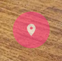

# Interactive Exploration with Matterport in 

This project explores the potential of Angular 17 for creating engaging and interactive 3D experiences. By leveraging the Matterport platform (or a similar 3D space provider), the project aims to: **Enhance User Engagement**, **Unlock New Possibilities**, **Push the Boundaries**.

This project can serve as a valuable learning experience for developers interested in:

*Exploring the potential of 3D in web development* - *Learning how to integrate Angular with 3D platforms* - *Building interactive and engaging user interfaces* - *Pushing the boundaries of web technology*

## Pre-Requisites

* Node.js and npm (or yarn)
* The Angular development environment (ng)

## Installation Steps

### Clone the Repository

Open a terminal or command prompt.\
Navigate to the directory where you want to clone the project.

Use the git clone command followed by the URL of your GitHub repository. For example:

```bash
git clone https://github.com/gbrogio/matterport-sdk-angular.git
```

### Install Dependencies

Navigate to the project directory you just cloned:

```bash
cd your-project-name
```

```bash
npm install
```

### Set up your Matterport SDK Key

You will be need a *Matterport 3D spaces*, and *Matterport SDK key*.\
Follow [Matterport developer portal](https://matterport.com/developers).
Store the key securely in your environment variables (avoid committing it to your GitHub repository!). You can find instructions on setting up environment variables on the official documentation for your operating system.

### Running the Application

Start the Development Server:\
In your terminal, within the project directory, run:

```bash
ng serve
```

This will start the Angular development server, which typically runs on [http://localhost:4200](http://localhost:4200) by default. You can access the application in your web browser at this URL.

## HTML Template Configuration

```html
<!-- Replace <MODEL_KEY> to your place model id in Matterport -->
<iframe #iframe src="https://my.matterport.com/show?m=<MODEL_KEY>&hr=0&title=0" frameBorder="0" allowFullScreen></iframe>

<!-- Elements for get specific position in model view -->
<button #button type="button">...</button>
<p #text></p>
```

*#iframe*, *#button*, *#text* are essential to get these elements into `app.component.ts`

## Button Position

After a delay without any move, a button will be appears in screen. with this button you can get every position in your model, and use it for create Tags.



The button only appears if you stay with mouse in your iframe.

## Create a Tag

For create a tag you can use the code bellow:

```ts
async ngAfterViewInit() {
  // code above...

  await this.createTag({
    html: `
      <h1>Place your HTML here</h1>
    `,
    position: { x: ..., y: ..., z: ... },
    offset: { x: ..., y: ..., z: ... },
    icon: '...', // you can see all icons in https://matterport.github.io/showcase-sdk/tags_icons_reference.html 
    color: '#5f5bf9',
  })

  // code bellow...
```

For more performance you can paste all tags creation in a `await Promise.all([...])`

```ts
// code above...

await Promise.all([
  this.createTag({...}),
  this.createTag({...}),
  this.createTag({...}),
  this.createTag({...}),
])

// code bellow...
```

### Roadmap for structure

```bash
> src
  | > app
  |   |- app.component.css
  |   |- app.component.html
  |   |- app.component.ts
  |   |- app.config.ts
  |   |- app.routes.ts
  |
  | > types
  |   |- matter-port-icons.ts
  | > types
  |   |- hex-to-rgb.ts
  |
  |- index.html
  |- main.ts
  |- styles.css

package.json
angular.json
bun.lockb

tsconfig.app.json
tsconfig.json
tsconfig.json

.editorconfig
.gitignore

README.md
```

OBS: Remember that you need replace the <MODEL_KEY> and <MATTER_PORT_SDK_KEY> for the project works.
